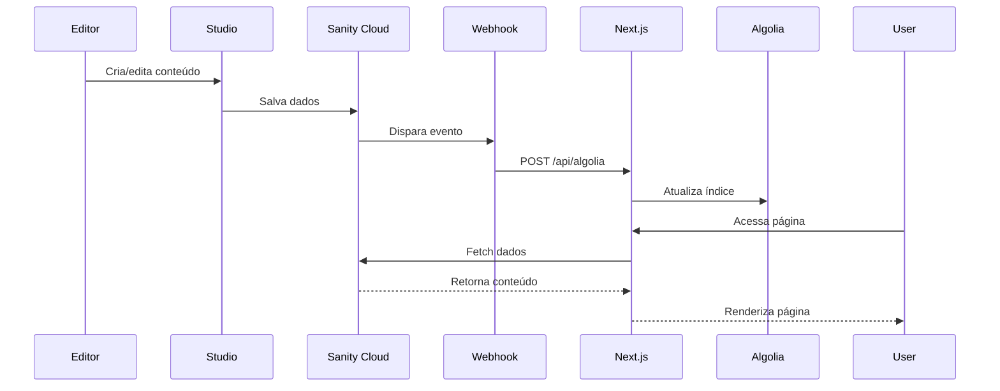

## 3. Live Preview (Tempo Real)

### 3.1 Configuração

```typescript
// sanity/lib/live.ts
import { defineLive } from "next-sanity";

export const { sanityFetch, SanityLive } = defineLive({
  client,
  serverToken: token,
  browserToken: token,
  fetchOptions: { revalidate: 0 },
});
```

### 3.2 Draft Mode

```typescript
// app/api/draft-mode/enable/route.ts
export async function GET(request: Request) {
  const token = request.headers.get("sanity-preview-secret");
  
  if (token !== process.env.SANITY_API_READ_TOKEN) {
    return new Response("Invalid token", { status: 401 });
  }

  draftMode().enable();
  return new Response("Draft mode enabled");
}
```

### 3.3 Visual Editing

```typescript
// app/layout.tsx
import { VisualEditing } from "next-sanity";

export default async function RootLayout({ children }) {
  const { isEnabled } = await draftMode();
  
  return (
    <html>
      <body>
        {isEnabled && <VisualEditing />}
        {children}
      </body>
    </html>
  );
}
```

---

## 4. Webhooks e Sincronização

### 4.1 Configuração do Webhook no Sanity

```javascript
// No Sanity Studio > Settings > Webhooks
{
  name: "Sync with Algolia",
  url: "https://seu-site.com/api/algolia",
  trigger: "create, update, delete",
  filter: "_type == 'post'",
  secret: "seu-webhook-secret"
}
```

### 4.2 Endpoint no Next.js

```typescript
// app/api/algolia/route.ts
export async function POST(request: Request) {
  // Validar assinatura do webhook
  const signature = request.headers.get(SIGNATURE_HEADER_NAME);
  const body = await request.text();
  
  if (!isValidSignature(body, signature, webhookSecret)) {
    return new Response("Invalid signature", { status: 401 });
  }

  // Processar payload
  const { _id, operation } = JSON.parse(body);
  
  if (operation === "delete") {
    await algoliaClient.deleteObject({ indexName, objectID: _id });
  } else {
    await algoliaClient.saveObject({ indexName, body: { ...value, objectID: _id } });
  }
}
```

---

## 5. Tipos Compartilhados

### 5.1 Geração de Tipos

```bash
# No Sanity Studio
npx sanity typegen generate

# Gera sanity.types.ts com tipos TypeScript
```

### 5.2 Uso no Next.js

```typescript
import type { Post, Person } from "@/sanity.types";

interface PageProps {
  post: Post;
  author: Person;
}
```

---

## 6. Revalidação de Cache

### 6.1 On-Demand Revalidation

```typescript
// Após webhook do Sanity
import { revalidatePath, revalidateTag } from "next/cache";

export async function POST(request: Request) {
  // Processar webhook...
  
  // Revalidar páginas afetadas
  revalidatePath("/posts");
  revalidateTag("posts");
}
```

### 6.2 Time-based Revalidation

```typescript
// Em página ou componente
export const revalidate = 60; // Revalidar a cada 60 segundos
```

---

## 7. Estrutura de Pastas

### 7.1 Monorepo Simplificado

```
cms_agentes_integrados/
├── nextjs-crew-agentes-integrados/    # App Next.js
│   ├── app/                          # App Router
│   ├── sanity/                       # Configuração cliente
│   └── package.json
│
└── studio-crew-agentes-integrados/    # Sanity Studio
    ├── src/                          # Schemas
    ├── sanity.config.ts              # Configuração
    └── package.json
```

### 7.2 Scripts Compartilhados

```json
// package.json raiz
{
  "scripts": {
    "dev": "npm run dev:next & npm run dev:studio",
    "dev:next": "cd nextjs-crew-agentes-integrados && npm run dev",
    "dev:studio": "cd studio-crew-agentes-integrados && npm run dev"
  }
}
```

---

## 8. CORS e Segurança

### 8.1 Configuração CORS no Sanity

```bash
# Permitir Next.js acessar Sanity
npx sanity cors add http://localhost:3000 --credentials
npx sanity cors add https://seu-dominio.com --credentials
```

### 8.2 Tokens e Segurança

```typescript
// Variáveis de ambiente
SANITY_API_READ_TOKEN=skXXX...      // Token de leitura (draft)
SANITY_WEBHOOK_SECRET=secret123     // Validação webhooks
NEXT_PUBLIC_SANITY_PROJECT_ID=xxx   // ID público do projeto
```

---

## 9. Fluxo de Desenvolvimento

### 9.1 Desenvolvimento Local

1. **Iniciar Studio**: `npm run dev` (porta 3333)
2. **Iniciar Next.js**: `npm run dev` (porta 3000)
3. **Criar conteúdo** no Studio
4. **Ver resultado** imediato no Next.js

### 9.2 Preview Links

```typescript
// No Sanity Studio
function resolveProductionUrl(doc) {
  return `http://localhost:3000/api/draft-mode/enable?redirect=/posts/${doc.slug.current}`;
}
```

---

## 10. Debugging e Troubleshooting

### 10.1 Verificar Conexão

```typescript
// Teste no Next.js
import { client } from "@/sanity/lib/client";

async function testConnection() {
  try {
    const result = await client.fetch('*[_type == "post"][0]');
    console.log("Conexão OK:", result);
  } catch (error) {
    console.error("Erro de conexão:", error);
  }
}
```

### 10.2 Logs de Webhook

```typescript
// app/api/algolia/route.ts
export async function POST(request: Request) {
  console.log("Webhook recebido");
  console.log("Headers:", request.headers);
  console.log("Body:", await request.text());
  // ...
}
```

---

## 11. Melhores Práticas

### 11.1 Performance

- Use `useCdn: true` para conteúdo público
- Implemente caching adequado
- Otimize queries GROQ
- Use projeções para reduzir payload

### 11.2 Desenvolvimento

- Mantenha schemas sincronizados
- Use tipos TypeScript gerados
- Implemente error boundaries
- Monitore webhooks

### 11.3 Segurança

- Nunca exponha tokens de escrita
- Valide webhooks com assinatura
- Use CORS apropriadamente
- Implemente rate limiting

---

## 12. Diagrama de Sequência



---

## Conclusão

A integração Next.js + Sanity oferece:

1. **Separação de concerns**: CMS vs Frontend
2. **Flexibilidade**: Múltiplos frontends possíveis
3. **Performance**: CDN global e caching
4. **Developer Experience**: Hot reload e preview
5. **Escalabilidade**: Arquitetura desacoplada

O segredo está na comunicação via API, webhooks para sincronização e tipos compartilhados para type safety.


### Live Preview
```typescript
// sanity/lib/live.ts
export const { sanityFetch, SanityLive } = defineLive({
  client,
  serverToken: token,
  browserToken: token,
  fetchOptions: { revalidate: 0 },
});
```

### Queries GROQ
```typescript
// sanity/lib/queries.ts
export const postsQuery = groq`
  *[_type == "post" && defined(slug.current)] | order(date desc, _updatedAt desc) {
    _id,
    title,
    slug,
    excerpt,
    coverImage,
    "date": coalesce(date, _updatedAt),
    "author": author->name,
  }
`;
```


quero uma explicação detalhada sobre o GROQ nesse contexto.